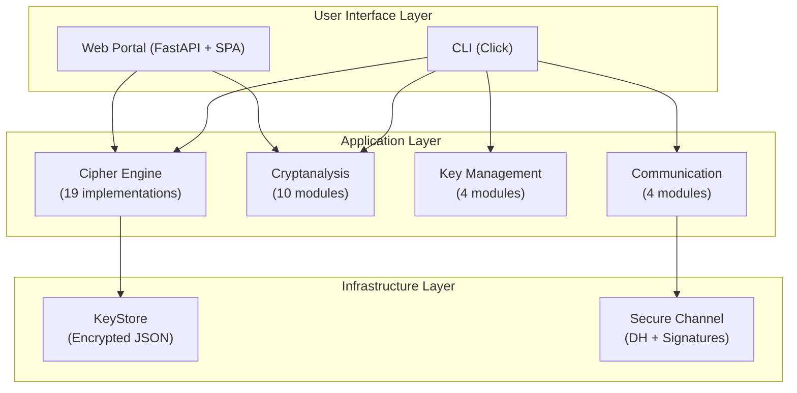

# Deliverable Technical Package — Architecture Blueprint

**Version:** 0.2.0  
**Date:** June 2026  

---

## 1. System Architecture Overview



## 2. Module Structure

### 2.1 Package Layout

```
cryptovault/
├── __init__.py              # Package root, version, cipher re-exports
├── cli.py                   # Click CLI entry point
├── ciphers/
│   ├── __init__.py          # Re-exports all cipher classes
│   ├── base.py              # CipherBase ABC
│   ├── caesar.py            # CaesarCipher
│   ├── vigenere.py          # VigenereCipher
│   ├── vernam.py            # VernamCipher
│   ├── transposition.py     # ColumnarTransposition variants
│   ├── binary_utils.py      # Binary conversion utilities
│   ├── playfair.py          # PlayfairCipher
│   ├── railfence.py         # RailFenceCipher
│   ├── affine.py            # AffineCipher
│   ├── atbash.py            # AtbashCipher
│   ├── bacon.py             # BaconCipher
│   ├── hill.py              # HillCipher
│   ├── bifid.py             # BifidCipher
│   ├── trifid.py            # TrifidCipher
│   ├── foursquare.py        # FourSquareCipher
│   ├── porta.py             # PortaCipher
│   ├── adfgvx.py            # ADFGVXCipher
│   ├── monoalphabetic.py    # MonoalphabeticCipher
│   └── myszkowski.py        # MyszkowskiCipher
├── cryptanalysis/
│   ├── __init__.py
│   ├── frequency.py
│   ├── index_of_coincidence.py
│   ├── kasiski.py
│   ├── caesar_cracker.py
│   ├── playfair_cracker.py
│   ├── affine_cracker.py
│   ├── railfence_cracker.py
│   ├── hill_cracker.py
│   ├── bifid_cracker.py
│   └── adfgvx_cracker.py
├── keymanagement/
│   ├── __init__.py
│   ├── generator.py
│   ├── keystore.py
│   ├── rotation.py
│   └── diffie_hellman.py
└── protocols/
    ├── __init__.py
    ├── mac.py
    ├── signing.py
    ├── envelope.py
    └── channel.py
```

### 2.2 Class Hierarchy — CipherBase

```mermaid
classDiagram
    class CipherBase {
        <<abstract>>
        +name: str
        +encrypt(plaintext: str, key: str) str
        +decrypt(ciphertext: str, key: str) str
        +crack(ciphertext: str, **kwargs) list
    }

    class CaesarCipher {
        +name = "caesar"
        +encrypt(plaintext, key) str
        +decrypt(ciphertext, key) str
        +crack(ciphertext) list
    }

    class VigenereCipher {
        +name = "vigenere"
        +encrypt(plaintext, key) str
        +decrypt(ciphertext, key) str
    }

    class VernamCipher {
        +name = "vernam"
        +encrypt(plaintext, key) str
        +decrypt(ciphertext, key) str
    }

    class PlayfairCipher {
        +name = "playfair"
        +encrypt(plaintext, key) str
        +decrypt(ciphertext, key) str
    }

    class HillCipher {
        +name = "hill"
        +encrypt(plaintext, key) str
        +decrypt(ciphertext, key) str
    }

    class AffineCipher {
        +name = "affine"
        +encrypt(plaintext, key) str
        +decrypt(ciphertext, key) str
        +crack(ciphertext) list
    }

    class AtbashCipher {
        +name = "atbash"
        +encrypt(plaintext, key) str
        +decrypt(ciphertext, key) str
    }

    class BaconCipher {
        +name = "bacon"
        +encrypt(plaintext, key) str
        +decrypt(ciphertext, key) str
    }

    class BifidCipher {
        +name = "bifid"
        +encrypt(plaintext, key) str
        +decrypt(ciphertext, key) str
    }

    class TrifidCipher {
        +name = "trifid"
        +encrypt(plaintext, key) str
        +decrypt(ciphertext, key) str
    }

    class FourSquareCipher {
        +name = "foursquare"
        +encrypt(plaintext, key) str
        +decrypt(ciphertext, key) str
    }

    class PortaCipher {
        +name = "porta"
        +encrypt(plaintext, key) str
        +decrypt(ciphertext, key) str
    }

    class ADFGVXCipher {
        +name = "adfgvx"
        +encrypt(plaintext, key) str
        +decrypt(ciphertext, key) str
    }

    class MonoalphabeticCipher {
        +name = "monoalphabetic"
        +encrypt(plaintext, key) str
        +decrypt(ciphertext, key) str
    }

    class MyszkowskiCipher {
        +name = "myszkowski"
        +encrypt(plaintext, key) str
        +decrypt(ciphertext, key) str
    }

    class ColumnarTransposition {
        +name = "columnar"
        +encrypt(plaintext, key) str
        +decrypt(ciphertext, key) str
    }

    class InvertedColumnarTransposition {
        +name = "inverted_columnar"
    }

    class SymmetricColumnarTransposition {
        +name = "symmetric_columnar"
    }

    class RailFenceCipher {
        +name = "railfence"
        +encrypt(plaintext, key) str
        +decrypt(ciphertext, key) str
        +crack(ciphertext) list
    }

    CipherBase <|-- CaesarCipher
    CipherBase <|-- VigenereCipher
    CipherBase <|-- VernamCipher
    CipherBase <|-- PlayfairCipher
    CipherBase <|-- HillCipher
    CipherBase <|-- AffineCipher
    CipherBase <|-- AtbashCipher
    CipherBase <|-- BaconCipher
    CipherBase <|-- BifidCipher
    CipherBase <|-- TrifidCipher
    CipherBase <|-- FourSquareCipher
    CipherBase <|-- PortaCipher
    CipherBase <|-- ADFGVXCipher
    CipherBase <|-- MonoalphabeticCipher
    CipherBase <|-- MyszkowskiCipher
    CipherBase <|-- ColumnarTransposition
    CipherBase <|-- RailFenceCipher
    ColumnarTransposition <|-- InvertedColumnarTransposition
    ColumnarTransposition <|-- SymmetricColumnarTransposition
```



## 3. Cipher Catalog

| # | Cipher | Category | Key Type | Key Space | Vulnerable To |
|---|---|---|---|---|---|
| 1 | Caesar | Monoalphabetic | Shift (0-25) | 26 | Brute-force, frequency analysis |
| 2 | Affine | Monoalphabetic | (a,b) pair | 312 | Brute-force, known-plaintext |
| 3 | Atbash | Monoalphabetic | None (fixed) | 1 | Self-inverse |
| 4 | Monoalphabetic | Monoalphabetic | Permutation | 26! ≈ 4×10²⁶ | Hill-climbing, frequency |
| 5 | Vigenere | Polyalphabetic | Keyword | 26^L | Kasiski, IoC, frequency |
| 6 | Porta | Polyalphabetic | Keyword | 13^L | Known-plaintext |
| 7 | Playfair | Digraph | Keyword (5×5) | 25! ≈ 1.5×10²⁵ | Frequency, crib-dragging |
| 8 | Hill | Polygraphic | Matrix (n×n) | 26^(n²) | Known-plaintext (n+1 pairs) |
| 9 | Four-Square | Digraph | Two keywords | (25!)² | Frequency |
| 10 | Bifid | Fractionation | Keyword (5×5) | 25! | IoC, frequency |
| 11 | Trifid | Fractionation | Keyword (3×3×3) | 27! | IoC, frequency |
| 12 | Columnar | Transposition | Keyword | n! | Anagramming, frequency |
| 13 | Inverted Columnar | Transposition | Keyword | n! | Anagramming |
| 14 | Symmetric Columnar | Transposition | Permutation | n! | Anagramming |
| 15 | Rail Fence | Transposition | Rail count | n-2 | Pattern analysis |
| 16 | Myszkowski | Transposition | Repeated keyword | n! | Anagramming |
| 17 | Vernam | XOR/OTP | Random bits | 2^n | Weak key reuse |
| 18 | Bacon | Steganographic | Alphabet mapping | 2⁴ = 16 | Pattern detection |
| 19 | ADFGVX | Composite | Polybius key + columnar | 36! × n! | Frequency, crib |

## 4. Data Models

### 4.1 CipherBase Interface

```python
class CipherBase(ABC):
    @property
    @abstractmethod
    def name(self) -> str: ...

    @abstractmethod
    def encrypt(self, plaintext: str, key: str) -> str: ...

    @abstractmethod
    def decrypt(self, ciphertext: str, key: str) -> str: ...

    def crack(self, ciphertext: str, **kwargs) -> list[tuple[str, str, float]]:
        raise NotImplementedError
```

### 4.2 Key Management Models

```python
@dataclass
class KeyState:
    key_id: str
    cipher_type: str
    created_at: datetime
    expires_at: datetime | None
    use_count: int
    max_uses: int | None

@dataclass
class KeyRotationPolicy:
    max_age: timedelta | None
    max_uses: int | None
    pre_rotation_warning: timedelta
    auto_rotate: bool

@dataclass
class DHKeyPair:
    private_key: int
    public_key: int
    parameters: DHParameters

@dataclass
class DHParameters:
    prime: int
    generator: int
    bit_length: int
```

### 4.3 Protocol Models

```python
@dataclass
class SessionState:
    session_id: str
    established_at: datetime
    expires_at: datetime
    shared_secret: bytes

@dataclass
class HandshakeMessage:
    sender_id: str
    public_key: int
    nonce: bytes
    signature: bytes
```

## 5. API Specifications

### 5.1 Python API

```python
from cryptovault import CaesarCipher, VigenereCipher

# Encrypt
cipher = CaesarCipher()
encrypted = cipher.encrypt("HELLO", "3")    # "KHOOR"
decrypted = cipher.decrypt("KHOOR", "3")    # "HELLO"

# Crack
results = cipher.crack("KHOOR")  # [("3", "HELLO", 1.0)]

# Analyze
from cryptovault.cryptanalysis import frequency_analysis
freq = frequency_analysis("KHOOR")
```

### 5.2 CLI API

```bash
# Encrypt
cryptovault encrypt --cipher caesar --key 3 --input "HELLO"

# Decrypt
cryptovault decrypt --cipher vigenere --key "SECRET" --input "ZINCS..."

# Crack
cryptovault crack --cipher caesar --input "KHOOR"

# Analyze
cryptovault analyze --input "KHOOR"

# Key generation
cryptovault keygen --cipher vigenere --length 12

# DH Demo
cryptovault dh-demo
```

### 5.3 Web API (Planned)

```
POST /api/cipher
  Body: { cipher: str, key: str, plaintext: str, action: "encrypt"|"decrypt" }
  Response: { result: str, steps: list[str] }

POST /api/analysis/{method}
  Body: { text: str, ... }
  Response: { results: dict }

GET /api/ciphers
  Response: { ciphers: list[CipherInfo] }

POST /api/labs/{lab_id}/submit
  Body: { answer: str }
  Response: { correct: bool, feedback: str }
```

## 6. TOGAF/Zachman Alignment

| Zachman Cell | Implementation |
|---|---|
| What (Data) | CipherText, PlainText, Key, AnalysisResult |
| How (Function) | encrypt(), decrypt(), crack(), analyze() |
| Where (Network) | CLI (local), Web (HTTP), API (REST) |
| Who (People) | Student, Researcher, Educator |
| When (Time) | Key rotation policies, session expiry |
| Why (Motivation) | Educational cryptography literacy |

## 7. Technology Stack

| Layer | Technology | Version |
|---|---|---|
| Language | Python | ≥3.10 |
| CLI Framework | Click | ≥8.0 |
| Web Framework | FastAPI | ≥0.100 |
| ASGI Server | Uvicorn | ≥0.23 |
| Frontend | Vanilla JS + CSS | ES2022 |
| Testing | pytest | ≥7.0 |
| Linting | ruff | ≥0.1.0 |
| Type Checking | mypy | ≥1.0 |
| Build | pyproject.toml | PEP 621 |
