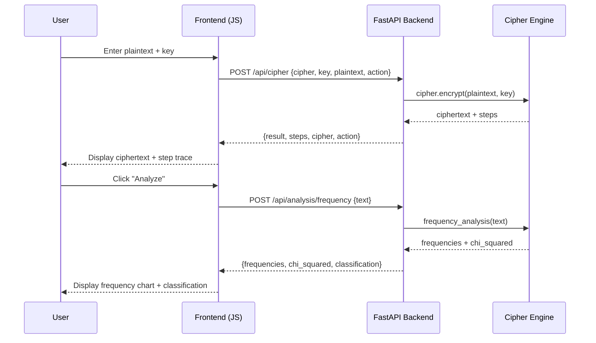

# Deliverable Technical Package — Web Portal Architecture

**Version:** 0.2.0  
**Date:** June 2026  

---

## 1. Overview

The CryptoVault Web Portal is an interactive learning platform built with **FastAPI** (backend) and **vanilla JavaScript + CSS** (frontend). It provides hands-on cryptography labs, real-time cipher operations, and cryptanalysis tools through a scientific, typographically rigorous interface.

**Design Philosophy:**
- Zero npm/bundler build toolchain
- Scientific typographic aesthetic (ETH Zürich / ACM Digital Library style)
- ARIA/WCAG 2.1 accessible
- Responsive (mobile-first)
- Tab-based SPA routing (no page reloads)

## 2. Technology Stack

| Layer | Technology | Purpose |
|---|---|---|
| Backend | FastAPI ≥0.100 | REST API, OpenAPI docs |
| ASGI Server | Uvicorn ≥0.23 | Production server |
| Data Validation | Pydantic v2 | Request/response models |
| Frontend | Vanilla JS (ES2022) | SPA logic |
| Styling | CSS3 + CSS Variables | Scientific theme |
| Fonts | Latin Modern / STIX Two | Academic typography |
| Icons | Unicode + CSS | No external icon libraries |

## 3. Directory Structure

```
web/
├── api/
│   ├── __init__.py
│   ├── main.py              # FastAPI app, CORS, static files
│   ├── models.py            # Pydantic request/response models
│   └── routers/
│       ├── __init__.py
│       ├── cipher.py        # POST /api/cipher
│       ├── analysis.py      # POST /api/analysis/{method}
│       ├── ciphers.py       # GET /api/ciphers
│       └── labs.py          # POST /api/labs/{lab_id}/submit
├── static/
│   ├── index.html           # SPA shell
│   ├── css/
│   │   └── portal.css       # Scientific typographic theme
│   └── js/
│       ├── app.js           # Router, tab management
│       ├── cipher.js        # Cipher encrypt/decrypt UI
│       ├── analysis.js      # Analysis tools UI
│       ├── labs.js          # Interactive lab UI
│       └── refs.js          # Reference library UI
```

## 4. Backend Architecture

### 4.1 FastAPI Application

```python
# web/api/main.py
from fastapi import FastAPI
from fastapi.staticfiles import StaticFiles
from fastapi.middleware.cors import CORSMiddleware

app = FastAPI(
    title="CryptoVault Classical",
    description="Interactive classical cryptography learning platform",
    version="0.2.0",
    docs_url="/api/docs",
    redoc_url="/api/redoc",
)

app.add_middleware(
    CORSMiddleware,
    allow_origins=["*"],  # Restrict in production
    allow_methods=["*"],
    allow_headers=["*"],
)

app.include_router(cipher_router, prefix="/api")
app.include_router(analysis_router, prefix="/api")
app.include_router(ciphers_router, prefix="/api")
app.include_router(labs_router, prefix="/api")

app.mount("/", StaticFiles(directory="web/static", html=True))
```

### 4.2 Pydantic Models

```python
# web/api/models.py
from pydantic import BaseModel, Field
from typing import Literal

class CipherRequest(BaseModel):
    cipher: str = Field(..., description="Cipher name (e.g., 'caesar')")
    key: str = Field(..., description="Encryption/decryption key")
    plaintext: str = Field("", description="Plaintext to encrypt")
    ciphertext: str = Field("", description="Ciphertext to decrypt")
    action: Literal["encrypt", "decrypt"]

class CipherResponse(BaseModel):
    result: str
    steps: list[str]
    cipher: str
    action: str

class AnalysisRequest(BaseModel):
    text: str = Field(..., description="Text to analyze")
    language: str = Field("en", description="Expected language")

class FrequencyResponse(BaseModel):
    frequencies: dict[str, float]
    chi_squared: float
    classification: str

class CiphersResponse(BaseModel):
    ciphers: list[dict]

class LabSubmitRequest(BaseModel):
    answer: str
    lab_id: str

class LabSubmitResponse(BaseModel):
    correct: bool
    feedback: str
    hint: str | None = None
```

### 4.3 API Endpoints

| Method | Path | Description | Request | Response |
|---|---|---|---|---|
| POST | `/api/cipher` | Encrypt/decrypt | CipherRequest | CipherResponse |
| POST | `/api/analysis/frequency` | Frequency analysis | AnalysisRequest | FrequencyResponse |
| POST | `/api/analysis/index-of-coincidence` | IoC calculation | AnalysisRequest | dict |
| POST | `/api/analysis/kasiski` | Kasiski examination | AnalysisRequest | dict |
| POST | `/api/analysis/brute-force` | Brute-force attack | AnalysisRequest | list |
| GET | `/api/ciphers` | List all ciphers | — | CiphersResponse |
| GET | `/api/ciphers/{name}` | Cipher details | — | dict |
| POST | `/api/labs/{lab_id}/submit` | Submit lab answer | LabSubmitRequest | LabSubmitResponse |
| GET | `/api/health` | Health check | — | dict |

## 5. Frontend Architecture

### 5.1 SPA Router

```javascript
// web/static/js/app.js
class Router {
    constructor() {
        this.routes = {};
        this.currentTab = 'cipher';
        window.addEventListener('hashchange', () => this.route());
    }

    register(name, handler) {
        this.routes[name] = handler;
    }

    route() {
        const hash = location.hash.slice(1) || 'cipher';
        this.currentTab = hash;
        this.routes[hash]?.();
        this.updateNav();
    }

    updateNav() {
        document.querySelectorAll('.nav-tab').forEach(tab => {
            tab.classList.toggle('active', tab.dataset.tab === this.currentTab);
        });
    }
}

const router = new Router();
router.register('cipher', renderCipherTab);
router.register('analysis', renderAnalysisTab);
router.register('labs', renderLabsTab);
router.register('refs', renderRefsTab);
router.route();
```

### 5.2 Tab Structure

| Tab | ID | Content |
|---|---|---|
| **Cipher** | `#cipher` | Encrypt/decrypt any cipher with key input |
| **Analysis** | `#analysis` | Frequency, IoC, Kasiski, brute-force tools |
| **Labs** | `#labs` | 5 interactive learning exercises |
| **References** | `#refs` | 24 curated cryptographic references |

### 5.3 Learning Labs

| Lab | ID | Difficulty | Topic | Objective |
|---|---|---|---|---|
| 1 | `caesar-fundamentals` | Beginner | Caesar Cipher | Encrypt, decrypt, brute-force |
| 2 | `vigenere-breaking` | Intermediate | Vigenère Cipher | Kasiski examination, key recovery |
| 3 | `frequency-analysis` | Intermediate | Frequency Analysis | Identify cipher type from statistics |
| 4 | `playfair-cracking` | Advanced | Playfair Cipher | Crib-dragging, frequency attack |
| 5 | `field-ciphers` | Doctoral | ADFGVX | Complete WWI field cipher break |

### 5.4 CSS Theme — Scientific Typography

```css
/* web/static/css/portal.css */
:root {
    /* Color palette — academic journal style */
    --color-bg: #fdfdfd;
    --color-text: #1a1a2e;
    --color-primary: #16213e;
    --color-secondary: #0f3460;
    --color-accent: #e94560;
    --color-border: #d4d4d4;
    --color-code-bg: #f5f5f5;

    /* Typography — Latin Modern / STIX Two inspired */
    --font-serif: 'STIX Two Text', 'Latin Modern Roman', 'Georgia', serif;
    --font-mono: 'STIX Two Math', 'Latin Modern Mono', 'Consolas', monospace;
    --font-sans: 'Inter', 'Helvetica Neue', sans-serif;

    /* Spacing — modular scale (1.25) */
    --space-xs: 0.25rem;
    --space-sm: 0.5rem;
    --space-md: 1rem;
    --space-lg: 1.5rem;
    --space-xl: 2.5rem;
    --space-2xl: 4rem;

    /* Layout */
    --max-width: 72rem;
    --sidebar-width: 16rem;
}

/* Body */
body {
    font-family: var(--font-serif);
    font-size: 1.05rem;
    line-height: 1.6;
    color: var(--color-text);
    background: var(--color-bg);
    max-width: var(--max-width);
    margin: 0 auto;
    padding: var(--space-xl);
}

/* Code blocks */
code, pre {
    font-family: var(--font-mono);
    font-size: 0.9rem;
    background: var(--color-code-bg);
    border: 1px solid var(--color-border);
    border-radius: 4px;
    padding: var(--space-xs) var(--space-sm);
}

/* Tables — academic style */
table {
    width: 100%;
    border-collapse: collapse;
    font-size: 0.95rem;
}

th, td {
    border: 1px solid var(--color-border);
    padding: var(--space-sm) var(--space-md);
    text-align: left;
}

th {
    background: var(--color-primary);
    color: white;
    font-weight: 600;
}

/* Navigation tabs */
.nav-tab {
    font-family: var(--font-sans);
    font-size: 0.85rem;
    text-transform: uppercase;
    letter-spacing: 0.05em;
    padding: var(--space-sm) var(--space-md);
    border: none;
    background: transparent;
    cursor: pointer;
    border-bottom: 2px solid transparent;
}

.nav-tab.active {
    border-bottom-color: var(--color-accent);
    color: var(--color-accent);
}

/* Form inputs */
input, textarea, select {
    font-family: var(--font-mono);
    font-size: 0.95rem;
    padding: var(--space-sm) var(--space-md);
    border: 1px solid var(--color-border);
    border-radius: 4px;
    background: white;
    width: 100%;
    box-sizing: border-box;
}

/* Buttons */
.btn-primary {
    font-family: var(--font-sans);
    font-size: 0.85rem;
    text-transform: uppercase;
    letter-spacing: 0.05em;
    padding: var(--space-sm) var(--space-lg);
    background: var(--color-primary);
    color: white;
    border: none;
    border-radius: 4px;
    cursor: pointer;
}

.btn-primary:hover {
    background: var(--color-secondary);
}

/* ARIA focus indicators */
:focus-visible {
    outline: 2px solid var(--color-accent);
    outline-offset: 2px;
}
```

## 6. Data Flow



## 7. Accessibility (WCAG 2.1 AA)

| Requirement | Implementation |
|---|---|
| Keyboard navigation | All interactive elements focusable |
| Screen reader | ARIA labels, roles, live regions |
| Color contrast | ≥4.5:1 for normal text |
| Focus indicators | Visible `:focus-visible` outlines |
| Text resizing | Rem-based sizing, works up to 200% |
| Motion | `prefers-reduced-motion` media query |

## 8. Performance Targets

| Metric | Target |
|---|---|
| First Contentful Paint | <1.5s |
| Largest Contentful Paint | <2.5s |
| Time to Interactive | <3s |
| Total JS size | <50KB |
| Total CSS size | <20KB |
| API response time (p95) | <100ms |

## 9. Future Enhancements

| Feature | Priority | Version |
|---|---|---|
| User accounts + progress tracking | Medium | v0.4.0 |
| WebSocket real-time cipher visualization | Low | v0.5.0 |
| Export lab results as PDF | Medium | v0.4.0 |
| Multi-language UI | Low | v0.6.0 |
| Dark mode toggle | High | v0.3.1 |
| Mobile-optimized cipher keypad | Medium | v0.4.0 |
